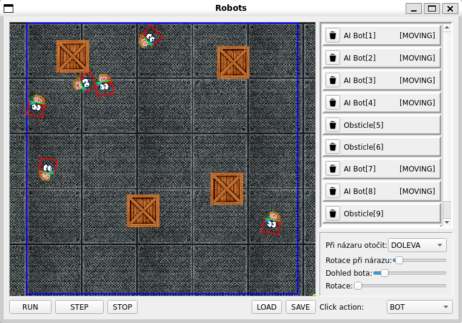

## ICP projekt simulace robotů

## Kompilace & stažení

Stažení repozitáře

    git clone https://github.com/Tolomaj/icp.git
    cd icp
    git submodule init

Program se kompiluje pomocí příkazu specifikovaných v zadání.

Ke zkompilování programu použijte:

    make 

K vytvoření dokumentace použijte:

    make doxygen

Ta se vygeneruje do složky docs/html
Ve složce docs/doxygen-awesome-css jsou styli které zvyšují přehlednost dokumentace 
Jedná se o [repozitář](https://github.com/jothepro/doxygen-awesome-css.git) kvuli omezení velikosti ovšem je ořezaný o dokumentaci a další věci nesouvisející s vzhledem

## Závislosti
### Příkazy
- doqigen
- qmake
### Knihovny
- Qt knihovny

## Implementovaná funkcionalita

### Plně inplementované
- přidávání objektů do scény
- odebírání objektů ve scéně
- ovládání simulace
- načítání a ukládání scén
- označení robotů pro přehledné sledování
- ovládání ovladatelných robotů ze seznamu objektů
- kolize a otáčení robotů
- nastavování parametrů robotů při přidávání do scény

### Neinplementované
- editace již existujících objektů
- odstranění všech objektů ve scéně tlačítkem (lze obejít načtením prázdného souboru)

## Rozdělení projektu
Projekt jsme inplementovali společně proto je tešší rozdělit kdo co přesně dělal. Ovšem projekt je rozdělený do dvou částí a každý měl zodpovědnost za svoji.

- GUI (složka gui) byla zodpovědností xgross13
- Simulace (složka sim) byla zodpovědností xfolty21
- Mediator (složka link) byla zodpovědností xgross13

## Návrh projektu

Projekt obsahuje 2 části GUI objekt a SIMULACE objekt. \
Komunikaci mezi objekty zařizuje objekt **mediator** který je jedináčkem obsahující metody k odebírání notifikací a notifikování odběratelů. 
Je tedy možné si gui s mediatorem přidat do vlastního projektu a používat gui nezávysle na simulaci. A to platí i pro simulaci.

## GUI a ovládací prvky programu

V gui upravujeme scénu myší. Ve spodní části si nastavujeme co kliknutí myši udělá (vkládání objektů nebo jejich odebírání).
na pravé části okna je seznam objektů které se ve scéně objevují. Odsud můžeme objekty odstraňovat a ovladatelné boty ovládat.

## Načítání/Ukládání do souboru
Načítání i ukládání lze zvolit v GUI to ovšem zašle pouze signál objektu dat simulace který soubor načte popřípadě uloží.
Data jsou ukládána ve formátu:

    AI_BOT {X} {Y} {ROTATION} {SENCE_LENGHT} {COLIDE_ROTATION} {ROTATION_DIRECTION}
    MAN_BOT {X} {Y} {ROTATION} {SENCE_LENGHT}
    BOX {X} {Y} {ROTATION}

## Použité návrhové vzory.

Objekt mediatoru používá **singleton** v kombinaci s **mediatorem**. Singleton dává všem objektům přístup k tomuto objektu na komunikaci mezi gui a simulací. A mediátorem je protože zajištuje komunikaci, jinou funkci neplní.

Objekt SceneResources je podle návrhového vzoru **Flywheight** a drží v sobě načtené textury použité ve scéně. To je dobré protože program konzumuje méně paměti.
Ikony tlačítek jsem se rozhodl z časových důvodů neimplementovat touto cestou.

**Template Method** je použitý v simulaci pro objekt Bot ten má metodu update která je pro robota ovládaného AI a člověkem jinak implementována ale volána jednotně.